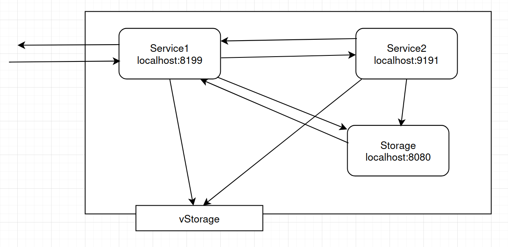

# DevOps - Exercise #1: Basics of containers and microservices

COMP.SE.140-2025-2026-1 Continuous Development and Deployment - DevOps

This is a course work repository.

## Basic platform information

- Operating system: Linux Mint 22.2 Cinnamon 6.4.8
- Virtual Machine: No
- Docker version: 27.5.1
- Docker-compose version: 1.29.2

## Service diagram

The project uses multiple services as shown below. The services are connected with Docker network and they communicate using HTTP requests. Service 1 and 2 create a record of timestamp, process uptime and free disk space. Storage appends these records to Docker volume for persistent storage and respond to a query of these records. vStorage is a host mounted file that service 1 and 2 both write themselfs.

REST interface and behaviour:

GET localhost:8199/status

1. **Service1** analyses its status and creates the above-described record
2. **Service1** sends the created record to **Storage** (HTTP POST Storage)
3. **Service1** writes the record to at the end of **vStorage**
4. **Service1** forward the request to **Service2** (HTTP GET Service2)
5. **Service1** analyses its status and creates the above-described record
6. **Service1** sends the created record to **Storage** (HTTP POST Storage)
7. **Service1** writes the record to at the end of **vStorage**
8. **Service1** sends the record as a response to **Service1**. (text/plain)
9. **Service1** combines the records (record1\nrecord2) end returns as a response (text/plain)

GET localhost:8199/log

1. **Service1** forwards the request to **Storage**
2. Returns the content of the log in text/plain.

## Content analysis of the status records

The service 1 and 2 status record includes three variables: timestamp, uptime and free disk space.

**Timestamp** is generated as soon as the service receives the request. The timestamp is in ISO 8601 format and UTC as “2025-09-03T12:06:181Z". I wanted in include milliseconds as well for intrest in seeing the delay between the two services.

**Uptime** is stamped right when the record is being created. It measures the process uptime not the system uptime in hours.

**Free Disk Space** gets the free space on the host machines disk that the process is running from. This record differs between the services and both of the services get different value that the operating system. Service1 differs a little and the Service2 differs a lot. So this metric is not to be trusted.

The relevance of these measurements differs. The timestamp and the uptime are a great metric and can be useful for log data but the free disk space gets values so different it should not be trusted. Not sure why this is as I did not look too much into it for this was not the main point of the project.

For the future. The free disk should be fixed to show correct values but it can also be removed as it does not really matter so much when the log files as small. More time details could be added to see how long the writing and returning to requests takes. Also the request methods could be logged aswell.

## Content analysis of the persistent storage solutions

Persistent storage with mounted host files was in this case harder to implement as the two services both write to it and with that is bad design. It did teach how to mount a file in Docker, but that was all it was good for. It would have been better if only the Storage -service writes the log files, as this whould have kept this simpler.

The Docker volume implementation with a separate service was the better solution and it taught how Docker volumes are used. It did take some time to get working but after that it simplified structure. The only downside from Docker volumes was the more difficult access to the log files for debugging.

## Running the project and cleanup

For course staff to test the system use the following instructions from the exercise document

1. `git clone -b exercise1 git@github.com:KivistoKasper/DevOps.git`
2. `cd DevOps/ex1/`
3. `docker-compose up --build`

The building of images can take couple minutes depending on internet conection, processing power and if the needed images are downloaded prehand.

4. `curl localhost:8199/status`
5. `docker-compose down`

Instructions for clearing up after testing the project.

**Delete only containers of this project and leave node and alpine**

1. Remove the docker volume `docker volume rm ex1_storage-volume`
2. Remove services `docker image rm ex1_storage ex1_service1 ex1_service2`
3. (Optional) Clear the vStorage attached to host `echo -n "" > vStorage`

**Remove all docker containder, volumes, networks and images**

`docker system prune -a --volumes`

After these the directory can be deleted.

## What was difficult and the main problems

I have worked with Docker and docker-compose before and thus the project was not too dificult. However it did prove to be more work than I anticipated. The Docker needed some work to get all things to work and the Docker volumes and host mount were all new. The most time consuming part was propably the Service2 as the C++ needed to be remembered again and also the socket programming is challenging.

## Running in development

There are two ways to run the project in development. Locally outside of docker and inside docker. To run inside docker there are Docker dev files that run the project, anything more inside Docker development needs to be implemented.

### Locally

**Service1**

1. `npm install`
2. `npm run dev`

**Service2**

1. `g++ main.cpp -o main`
2. `./main`

**Storage**

1. `npm install`
2. `npm run dev`

### With Docker

1. `docker-compose -f docker-compose.dev.yml up`
2. `docker-compose -f docker-compose.dev.yml down`

**Check for running containers:**

`docker ps -a`

**Prune all**

1. `docker-compose -f docker-compose.dev.yml down --remove-orphans`
2. `docker system prune -af --volumes`
3. `docker volume rm ex1_storage-volume`
